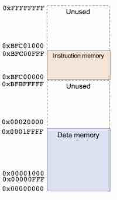

## ADIC MSc (2022 - 2023)

---
## Team Project - RISC-V RV32I Processor

**_Peter Cheung, V2.0 - 29 June 2023_**

---

## Objectives

* To learn RISC-V 32-bit integer instruction set architecture 
* To implememnt a single-cycle RV32I instruction set in a microarchitecture
* To implemententing the F1 starting light algorithm in RV32I assembly language
* To verify your RV32I design by executing the F1 light program
* As stretched goal, to implement a simple pipelined version of the microarchitecutre with or without hazard unit
* As a further stretched goal, add data cache to the pipelined RV32I, or
* As another  stretch goal, implement the RV32I processor on DE1-Soc FPGA Board

 

___

## Learning the RV32I Instruction Set
___

>Before you start the hardware design, every team member should learn the RV32I in some detail by jointly creating your team's assembly language program to implement the F1 starting light algorithm from Lab 3 in RV32I instructions.  

Your implementation **MUST** use at least one subroutine so that you must include the **Jump and Link (JAL)** instruction.  Your team's F1 program, together with another REFERENCE program from me will be used to test your processor implementation.

  
 
Unlike Lab 3, the clock signal does not control a hardware counter or state machine directly. Instead it is used to clock the RISC-V processor to execute one instruction.  The Reset signal also resets only the processor to start the program, and is not used to reset counters or a state machine.  The trigger signal is used to tell RISC-V when to start the F1 light sequence.  How it is implemented in the RISC-V is not defined.  You can decide, for example, that the trigger is automatic -- as soon as the program starts, the F1 light sequence is triggered.  Alternatively you may implement a simple interrupt mechanism so that when trigger is asserted (say from low to high), RISC-V will start running the F1 light subroutine. The starting address of the interrupt handling routine is stored in an address location (called the interrupt vector).

You should also write your assembly language program using the following memory map. 

  
 

This memory map is chosen to help debugging your design later.  What is the size of the data and instruction memory specified by this map?

___

## Single-Cycle RV32I Design
___

>This is the basic goal for every team - to implement the basic RV32I instruction set by extending your Reduced RISC-V design in Lab 4. 

You do not need to implement every instruction in the RV32I instruction set, but you must implement the JAL instruction so that you an run code that uses subroutines.

To simplify matter, you should assume that you have separate instruction and data memory.

Similar to Lab 4, you must divide the task into roughly equal compnents, and each student will then be responsbile for one components.  You can continue your role as in Lab 4 or, to diversify your learning by deliberately assigning a different component to your team members. The assessment of this project coursework will be mostly based on individual contributions with a smaller component based on the team's success.  Details on assessment and deliverable are provided later in this project brief.

The testbench and test protocol for this processor is to provide evidence that your team's design is working for your team's F1 starting light program.  You must also show evidence that your design also works for the REFERENCE program that I will provide later.

 

  
 

 

___
## Stretch Goal 1: Pipelined RV32I Design
___

>Once finished the basic goal, if your team have time, modify the the single-cycle processor to a pipelined processor.  

You should handle data and control hazards in software - by identifying and inserting NOPs, or by re-ordering instructions to avoid hazards.  You are not expected in implement hardware hazard detection, forwarding/bypassing or stalling hardware.

As before, make sure that your design is working by successfully running the team's version of the F1 light program.  Furthermore, your design should also run the reference program.  The details of this reference program is given in the folder **"reference"** on this github repo.

 

___
##  Stretch Goal 2: Add Hazard Unit to the pipelined architecture
___

Instead of using NOPs, you can design a hazard detection unit to check when data or control hazard has occurred.  For data hazard, some of the pipelined register values are invalid, and you can perform forwarding or bypassing to send updated data to the correct stage of the pipeline. (See notes.)  For control hazard, you may need to flush the pipeline altogether.
 

___

## BEYOND THIS COURSEWORK: Implementing your RV32I design on DE1-Soc FPGA Board
___

All of you have used the DE1-SoC board in the Autumn term.  You can check out a board from Level 1 Stores and transfer your design to Quartus. You can then compile and synthesis your design for this FPGA board.

 

 